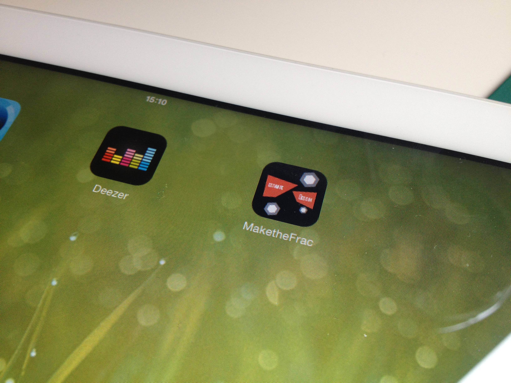

# whathefrac

## Application game where the goal is to rebuild the collection of a french museum

Technologies :

* Processing (java) compiled to javascript
* iOS Webview

### Ipad application icon

### Introduction screen of the game

### Game rules screen

### Game screen with newspaper associated
> The user can flash code on the newspaper for accessing to different level

### Game screen

